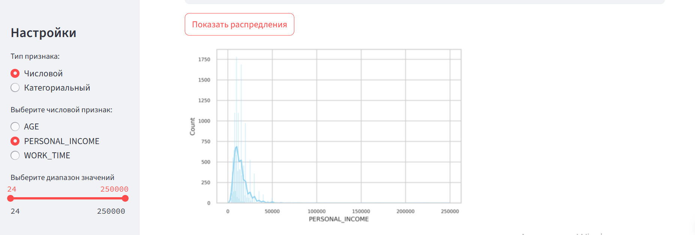
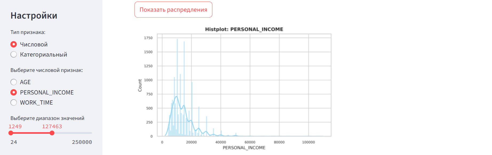

# Анализ отклика на маркетинговую кампанию — EDA и визуализация в Streamlit

## Описание датасета
В проекте используется датасет из курса [AI Education: Линейные модели](https://github.com/aiedu-courses/linear_models/tree/main/datasets/clients). Он состоит из нескольких таблиц, содержащих информацию о клиентах банка, их демографии, занятости, доходах и активности в рамках маркетинговой кампании.

Основной датасет формируется объединением следующих таблиц:
- `D_clients.csv` — демографические данные клиентов
- `D_job.csv` — информация о занятости
- `D_salary.csv` — сведения о доходах
- `D_mark.csv` — отклик на маркетинговую кампанию (целевая переменная)

## Цели и задачи проекта

**Цель:** провести разведочный анализ (EDA) и оценить взаимосвязь признаков с откликом на маркетинговую рассылку.

**Задачи:**
- Объединить разрозненные таблицы в единый датасет
- Исследовать распределения числовых и категориальных признаков
- Проверить статистически значимые различия между группами по таргету
- Оценить силу связи между признаками и целевой переменной
- Реализовать интерактивное приложение на Streamlit для визуального анализа

## Структура проекта
 `data_preparation.ipynb` | Объединение таблиц из набора `clients` и сохранение финального датасета (`cleaned_full_data.csv`)
`EDA_streamlit.ipynb` | Первичный анализ данных: визуализация, статистика, проверка гипотез
`plots_func.py` | Функции для построения графиков (boxplot, barplot, гистограммы, тепловые карты)
`app.py` | Streamlit-приложение: интерактивный выбор признаков, фильтрация, визуализация, выводы
`requirements.txt` | Зависимости проекта для установки окружения

## Превью приложения

Приложение доступно по ссылке:  
[Открыть Streamlit-приложение](https://eda-marketing-response-app-h2yfgv9c6foahrrdkhqvux.streamlit.app/)

---

### Общий вид

---

### Применение фильтров по числовым признакам
Пользователь может выбрать диапазон значений и строить графики по отфильтрованным данным:

 

---

###  Выбор типа графика
Пользователь может выбрать один из предложенных графиков:

- Для числовых признаков:

- Для категориальных признаков:

---

### Пример графика распределения значений (Barplot)

